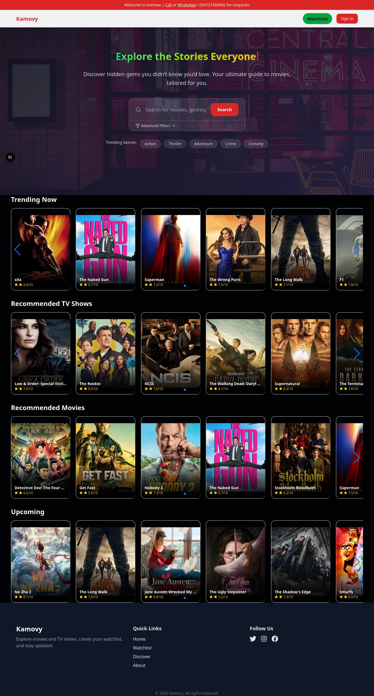
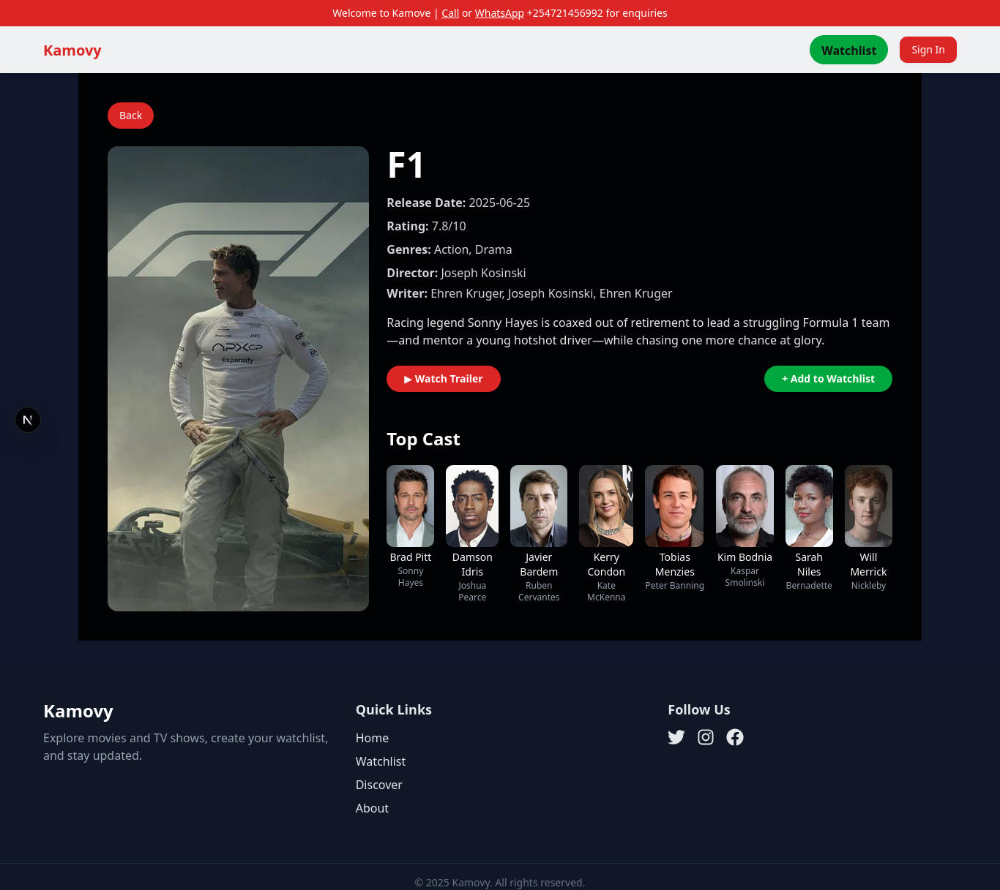
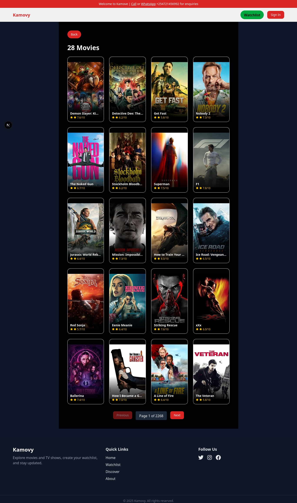
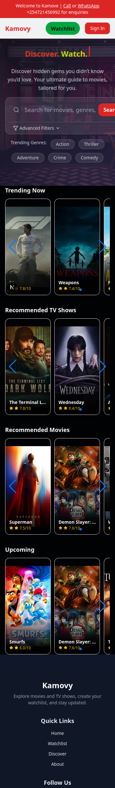

# Kamovie

Kamovie is a modern movie discovery web app built with [Next.js](https://nextjs.org). It helps you find trending, recommended, and upcoming movies, explore genres, and search for films using advanced filters.  

---

## **App Preview**

### **Hero Section & Search**
Discover trending movies and search by title, actor, or genre with instant suggestions:




### **Trending, Recommended & Upcoming Movies**
Swipe through different categories with responsive carousels:




### **Advanced Filters**
Filter movies by genre, year, rating, duration, or sort by popularity:



---

### **Mobile View**
Fully responsive design, optimized for mobile screens:



## **Features**

-  **Search** for movies, genres, or actors with instant suggestions.
-  **Trending, Recommended, and Upcoming** movie sections.
-  **Advanced Filters**: Filter by genre, year, rating, duration, and sort order.
-  **Trending Genres**: Quickly explore popular genres.
-  **Fast and Responsive** UI with React, Tailwind CSS, and Next.js App Router.
-  **State Management** using Redux and React Query.
-  **Modern UI** with [Geist](https://vercel.com/font) font, gradients, and [shadcn/ui](https://ui.shadcn.com/) components.
-  **Mobile Optimized**: Fully responsive for smartphones and tablets.

## **Technologies Used**

- [Next.js](https://nextjs.org)
- [React](https://react.dev)
- [Redux Toolkit](https://redux-toolkit.js.org/)
- [React Query](https://tanstack.com/query/latest)
- [Tailwind CSS](https://tailwindcss.com)
- [shadcn/ui](https://ui.shadcn.com/)
- [Lucide Icons](https://lucide.dev)
- [Geist Font](https://vercel.com/font)


## **Getting Started**

1. Clone the repository:

```bash
git clone https://github.com/Muasa-harman/kamovie.git
cd kamovie
